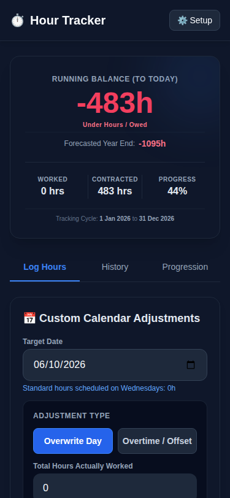
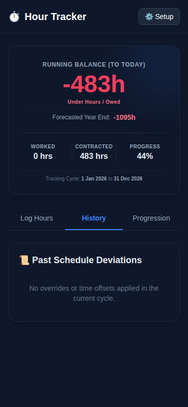

# ⏱️ Toil Tracker

[](https://opensource.org/licenses/MIT)
[](#android-application)
[](#standalone-web-app)

**Master your work-life balance with precision.** Toil Tracker is a high-performance work hour management system designed to track cumulative overtime, forecast year-end balances, and keep you ahead of your contractual obligations.

---

## 🚀 Key Features

- 📱 **Full Screen Experience:** Modern edge-to-edge Android interface for a seamless look.
- 🔮 **Balance Forecasting:** Predict your year-end hour balance based on current trends.
- 📱 **Native Performance:** Fully native Android application built with Jetpack Compose.
- 🗄️ **Robust Storage:** Powered by SQLite (Room) for efficient and reliable data management.
- ☁️ **Web Companion:** A responsive Flask-based web application for browser-based tracking.
- 🌙 **Dark Theme Only:** Sleek, high-contrast dark aesthetic optimized for focus and reduced eye strain.

---

## 📸 Screenshots (Mobile View)

| Dashboard | History | Calendar |
| :---: | :---: | :---: |
|  |  |  |

---

<a name="android-application"></a>
## 📱 Android Application

The Android version offers a robust, dedicated experience for mobile users.

### Tech Stack
- **Jetpack Compose:** Modern, declarative UI framework.
- **Kotlin:** Core business logic and ViewModel-driven architecture.
- **Room Database:** SQLite-based persistence for better performance.
- **Android API Level 36:** Optimized for the latest mobile features.

### Installation
1. Clone the repository.
2. Open the project in Android Studio.
3. Build and deploy the `app` module to your device.

---

<a name="standalone-web-app"></a>
## 🌐 Standalone Web App

Need a quick way to track hours on your desktop or via a server? Use the included Flask application.

### Quick Start (Web)
```bash
# Install dependencies
pip install flask

# Launch the server
python app.py
```
Access the dashboard at `http://localhost:5000`.

---

## ⚙️ Configuration

Tailor the system to your specific contract:
1. Tap the **Setup** icon.
2. Define your **Weekly Contracted Hours**.
3. Set your **Cycle Start Date** and **Year-End** targets.
4. Input your **Standard Weekly Schedule**.

---

## 🛠️ Built With

- [Jetpack Compose](https://developer.android.com/jetpack/compose) - Android's modern toolkit for building native UI.
- [Room](https://developer.android.com/training/data-storage/room) - A persistence library that provides an abstraction layer over SQLite.
- [Tailwind CSS](https://tailwindcss.com/) - Modern styling for the web companion.
- [Flask](https://flask.palletsprojects.com/) - Lightweight Python backend.
- [Kotlin](https://kotlinlang.org/) - Powering the Android core and logic.

---

## ⚖️ License

Distributed under the MIT License. See `LICENSE` for more information.

---

*Made with ❤️ for the hardworking.*
